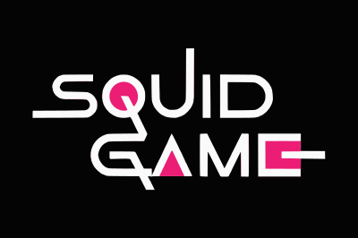

# Squid Game

## وب سایت فروش بازی

[دموی پروژه](https://star-academy.github.io/RezaKalbali/)

## هدف از توسعه

این وب سایت صرفا جهت آشنایی و فراگیری انگولار توسط
[رضا کلبعلی](https://github.com/rezakalbaali) در دوره [Star Academy](https://github.com/Star-Academy)
توسعه یافته است، در صورت نیاز می توانید از کد های موجود بهره ببرید یا در توسعه این پروژه سهیم باشید.

در این پروژه سعی می شود از مفاهیم مختلف انگولار در توسعه استفاده و از قواعد clean code پیروی شود. به همین دلیل بررسی و توسعه آن برای افرادی که اولین تجربه کار با انگولار را در حال گذراندن هستند می تواند مفید باشد.

## قابلیت CI / CD

با هر push آخرین نسخه build شده و روی branch مخصوص (gh-pages) قرار گرفته و در آدرس زیر قابل دسترسی است
https://star-academy.github.io/RezaKalbali/

## همکاری در توسعه Squid Game

برای مشارکت و همکاری در پروژه به فایل [CONTRIBUTING.md](https://github.com/Star-Academy/RezaKalbali/blob/start-landing/CONTRIBUTING.md) مراجعه کنید.

### ارتباط با توسعه دهنده

- [تلگرام](https://t.me/rezakalbali)
- [لینکدین](https://www.linkedin.com/in/rezakalbali/)
