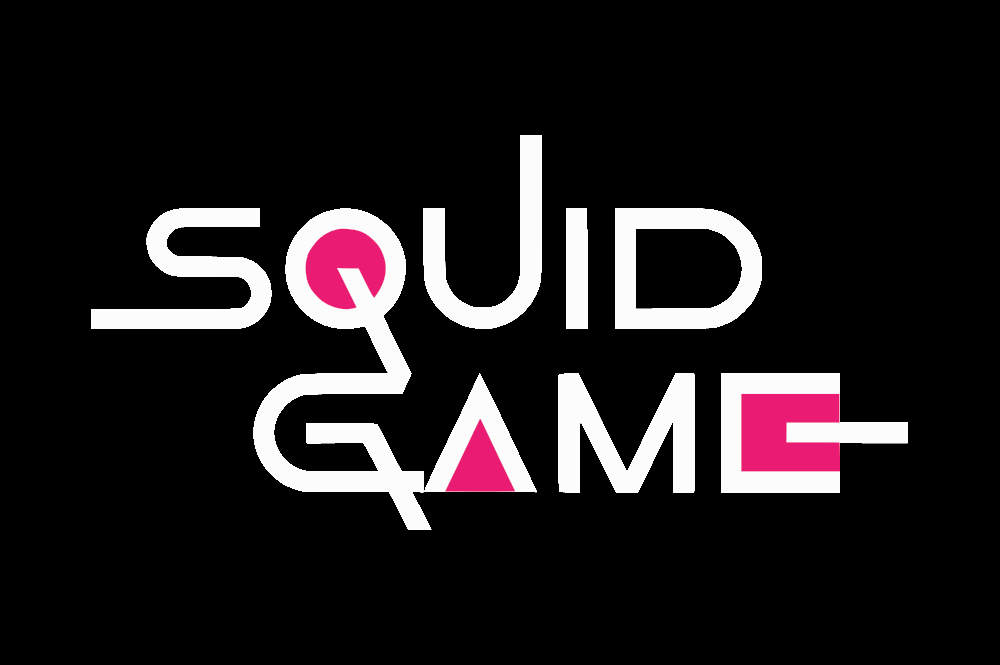

# Squid Game

## وب سایت فروش بازی

[مشاهده دموی پروژه](https://star-academy.github.io/RezaKalbali/)

این پروژه با [Angular CLI](https://github.com/angular/angular-cli) نسخه 12.2.17 تولید شده است

این وب سایت صرفا جهت آشنایی و فراگیری انگولار توسط
[رضا کلبعلی](https://github.com/rezakalbaali) در دوره [Star Academy](https://github.com/Star-Academy)
توسعه یافته است، در صورت نیاز می توانید از کد های موجود بهره ببریدیا در توسعه این پروژه سهیم باشید.

قابلیت CI/CD برای پروژه فعال می باشد و با هر push آخرین نسخه build شده و روی branch مخصوص (gh-pages) قرار گرفته و در آدرس زیر قابل دسترسی است
https://star-academy.github.io/RezaKalbali/

برای مشارکت و همکاری در پروژه به فایل [CONTRIBUTING.md](<https://github.com/Star-Academy/RezaKalbali/blob/start-landing/(https://github.com/Star-Academy/RezaKalbali/blob/start-landing/README.md)>) مراجعه کنید.

برای شروع توسعه می توانید از دستورات زیر استفاده کنید:

## Development server

Run `ng serve` for a dev server. Navigate to `http://localhost:4200/`. The app will automatically reload if you change any of the source files.

## Code scaffolding

Run `ng generate component component-name` to generate a new component. You can also use `ng generate directive|pipe|service|class|guard|interface|enum|module`.

## Build

Run `ng build` to build the project. The build artifacts will be stored in the `dist/` directory.

## Running unit tests

Run `ng test` to execute the unit tests via [Karma](https://karma-runner.github.io).

## Running end-to-end tests

Run `ng e2e` to execute the end-to-end tests via a platform of your choice. To use this command, you need to first add a package that implements end-to-end testing capabilities.

## Further help

To get more help on the Angular CLI use `ng help` or go check out the [Angular CLI Overview and Command Reference](https://angular.io/cli) page.
